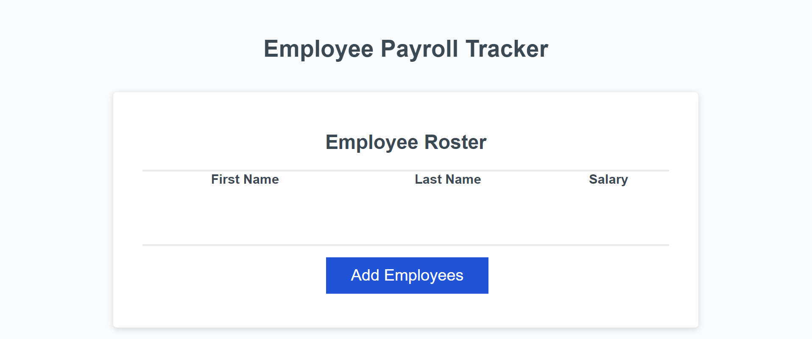
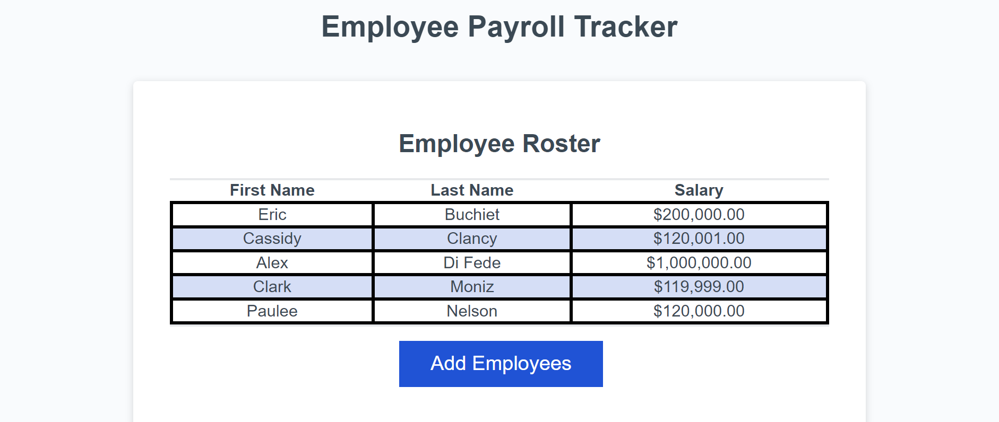
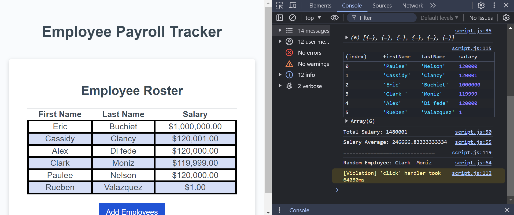

# Employee Payroll Tracker
This website tracks employee names, salary, and average salaries of all listed employees. It can also generate a random employee in the console if you would like to set up an employee lottery!

## Features
-**Employee Roster:** A roster that displays a table with employee's first and last name with their personal salary.

-**Add Employee Button:** A button that allows you to add Employee's to the roster.

-**Random Employee Generator:** A random employee genertator located in the concole.

## Technologies Used
**Frontend:**- CSS and HTML

**Backend:**- JavaScript

## Website Links

**Deployed Site:** https://pauleerama93.github.io/03-module-03-challenge/

**Google Doc:** https://docs.google.com/document/d/1gSOGwC9D6FRdNbrgqun1FucEKbeT93dE77jjjNvJTkQ/edit?usp=sharing 
I set up a todo with notes on how to complete the tasks in a google docs. You're more than welcome to check it out!

## Screenshots

## Credits

**UC Berkley's Bootcamp Staff:** Drew Hoang and Kyle Vance for all their support and guidence. 

**Starter Code:** Xander Rapstine (https://github.com/Xandromus) provided the stater code located on GitHub.

## User Story 
AS A payroll manager
I WANT AN employee payroll tracker
SO THAT I can see my employees' payroll data and properly budget for the company

**Acceptance Criteria:**
GIVEN an employee payroll tracker
WHEN I click the "Add employee" button
THEN I am presented with a series of prompts asking for first name, last name, and salary
WHEN I finish adding an employee
THEN I am prompted to continue or cancel
WHEN I choose to continue
THEN I am prompted to add a new employee
WHEN I choose to cancel
THEN my employee data is displayed on the page sorted alphabetically by last name, and the console shows computed and aggregated data

